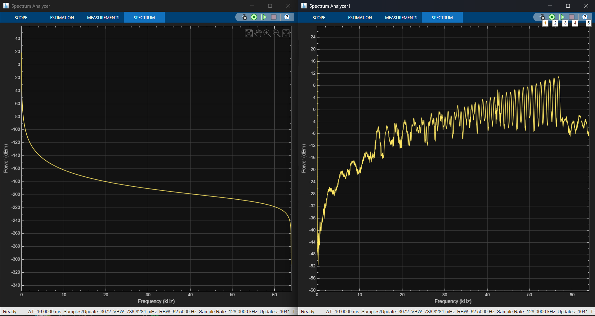
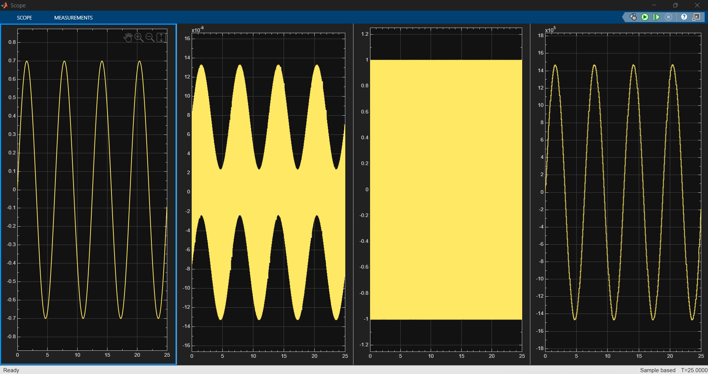

# Designing a High-Resolution Delta-Sigma ADC — The Quest for Precision

**ISRO VLSI Design Problem Statement — Mock Inter-IIT Tech Meet 15.0**
IIT Ropar VLSI Design Group

---

## 1. Overview

This repository contains the design, MATLAB/Simulink implementation, and simulation results for a **first-order, single-bit Delta-Sigma (ΔΣ) Analog-to-Digital Converter**, intended for high-resolution digitization of critical space-sensor signals.

The system consists of:
- A **first-order Delta-Sigma modulator** (integrator + 1-bit quantizer + 1-bit DAC feedback) generating an oversampled single-bit bitstream.
- A **digital decimation filter** (SincK / CIC) that suppresses shaped quantization noise and reduces the bitstream to a Nyquist-rate, multi-bit digital output.
- A **performance evaluation stage** that computes SNR and ENOB from FFT analysis of the reconstructed output, across Oversampling Ratios (OSR) of 64–256.

**Target specs:** output data rate 0.5–2 kSPS, ENOB ≈ 10–12 bits.

Full theoretical background, derivations, and methodology are documented in [`docs/Delta_Sigma_ADC_Technical_Report.pdf`](docs/Delta_Sigma_ADC_Technical_Report.pdf).

---

## 2. Requirements

- MATLAB R2022b or later
- Simulink
- Signal Processing Toolbox (for FFT/windowing functions)

---

## 3. Key Results

> Populate this section (and the plots below) after running `osr_sweep.m` and `plot_results.m`.

| OSR | f_out (SPS) | Measured SNR (dB) | ENOB (bits) |
|-----|-------------|--------------------|-------------|
| 64  | 2000        | 56.88              | 9.16        |
| 128 | 1000        | 67.48              | 10.92       |
| 256 | 500         | 75.28              | 12.21       |

### Plot 1 — Bitstream Spectrum (Noise Shaping Verification)

*Insert here:* FFT / power spectral density of the raw 1-bit modulator output, showing the quantization noise rising toward f_s/2 (first-order noise shaping). This verifies the theoretical NTF behavior derived in the report (Section III-F).

### Plot 2 — Decimated Output Spectrum / Reconstructed Waveform

*Insert here:* FFT of the decimated output at a representative OSR (e.g., OSR = 128), with the fundamental signal bin and in-band noise floor labeled — **or** a time-domain overlay of the reconstructed output against the original analog input.
---

## 4. Documentation

- **Technical Report:** [Docs/Technical Report.docx.pdf](Docs/Technical%20Report.pdf) — full theory, architecture, methodology, and performance analysis.
- **Problem Statement:** [`Docs/problem_statement.pdf`](docs/problem_statement.pdf) — original ISRO VLSI mock problem statement.

---

## 5. Team / Institution

**IIT Ropar VLSI Design Group**
Mock Inter-IIT Tech Meet 15.0 — ISRO VLSI Design Track

---

## 6. License

Specify your license here (e.g., MIT, Apache 2.0) or mark as coursework/competition submission if not intended for open redistribution.
